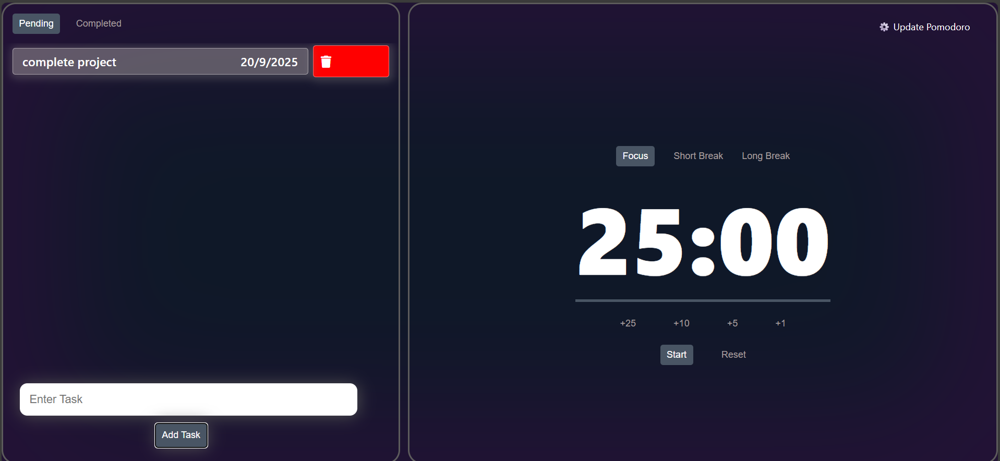
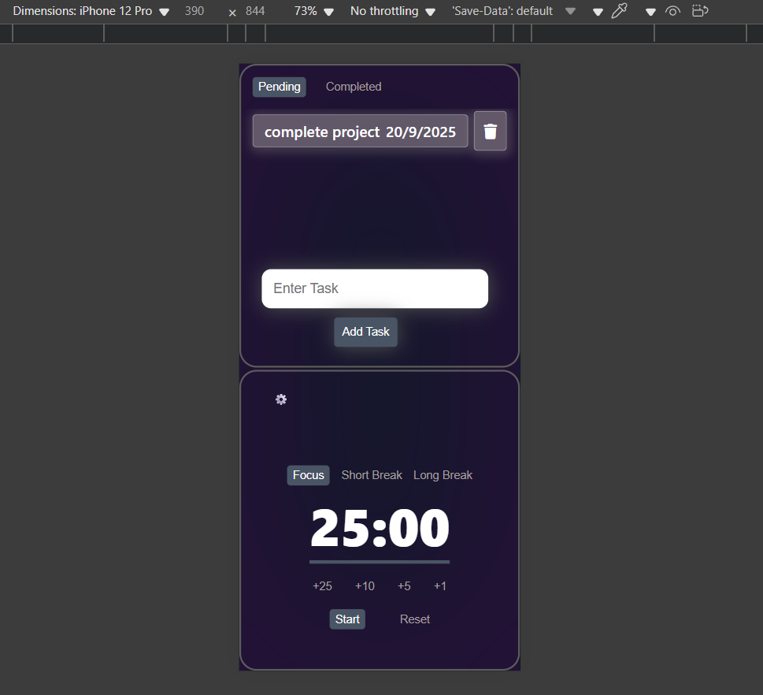

# ⏳ Pomodoro Timer Website

*A simple and effective Pomodoro Timer built with HTML, CSS, and JavaScript to help you stay focused and improve productivity.*

🔗 Live Demo: [Open Vercel Live Site](https://your-vercel-link.com)

## 🚀 Features

**🎯 Pomodoro Technique:** 25 min focus + 5 min break cycles

**🌓 Responsive Design:** Works on both desktop & mobile

*⏱️ Start / Pause / Reset Controls*

*🔔 Audio notification when timer ends*

*📊 Tracks multiple cycles*

## 🛠️ Tech Stack

HTML5

CSS3

JavaScript (Vanilla)

📸 Screenshots

